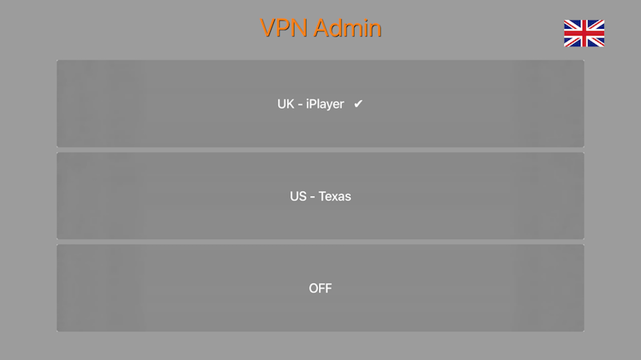

# VPN admin from AppleTV

Inspired by https://gist.github.com/superjamie/ac55b6d2c080582a3e64


#### Note: my first attempt at writing an AppleTV app. Most likely not the pretiest or most optimized code, but it does the job. :D 


## RPi setup

Follow instruction on the net to setup a RPi and attach it to your network using WIFI **and** ethernet. One card for VPN and one for SSH access.

Ex (my setup): eth0 - 192.168.0.60
 	wlan0 - 192.168.0.61

>> config files and source code need to be modified to match your network setup.

### Install VPN admin

Copy the files and folders from `server` into the `/home/pi/vpn.tv/` folder on your RPi. 

```
vpn.tv
├── config
├── flags
├── geo
├── vpn.jinja2
└── vpn.py
```


Install `geoip2` (`easy_install geoip2`)

Install `PIL` (`easy_install Pillow`) (you may need to install python-dev as well `sudo apt-get install python-dev`)

Run the command below to fetch the `GeoLite` country database. You should run it via `cron` at regular intervals (once a week is more then enough) to get the latest database.

```
wget -qO- http://geolite.maxmind.com/download/geoip/database/GeoLite2-Country.tar.gz | tar xvz -C /home/pi/vpn.tv/geo/ --strip 1
```

Copy the `vpn_admin.service` to `/lib/systemd/system/` and run 

```
sudo systemctl enable vpn_admin
sudo systemctl start vpn_admin
```

for testing/debuging  you can run `python /home/pi/vpn.tv/vpn.py` instead of starting the service. 


### Setup and set as startup service:

```
sudo apt-get install openvpn
sudo systemctl enable openvpn
```

No configuration files needed at this point. The VPN will not do anythng yet.

### Enable IP forwarding:

```
echo -e '\n#Enable IP Routing\nnet.ipv4.ip_forward = 1' | sudo tee -a /etc/sysctl.conf
sudo sysctl -p
```

### Setup NAT fron the local LAN down the VPN tunnel:

```
sudo iptables -t nat -A POSTROUTING -o tun0 -j MASQUERADE
sudo iptables -A FORWARD -i tun0 -o eth0 -m state --state RELATED,ESTABLISHED -j ACCEPT
sudo iptables -A FORWARD -i eth0 -o tun0 ! -d 192.168.0.0/16 -j ACCEPT
```

### Make the NAT rules persistent across reboot:

```
sudo apt-get install iptables-persistent
sudo netfilter-persistent save
sudo systemctl enable netfilter-persistent
```

## VPN service 

Sign up for a VPN service that supports **OpenVPN** (eg: vpnunlimitedapp.com), download the configuration files and add them `config` folder (copied from github) with `.conf` extention. Give them meaningful names (eg: `UK -iPlayer.conf`).

## tvOS

Manually config your AppleTV network to point the `router` IP to the RPi IP (`192.168.0.60`)

Using your own Apple Developer ID compile/sign/install the tvOS app on your AppleTV to be able to control the VPN. A "legacy" web interface is available as well and it can be accessed from your browser on a computer or mobile device. Just go to `http://192.168.0.60`

The menu is formed by the names of the OpenVPN config files on the RPi (reason why they should have meaningful names). 

- The flag represents the county that the remote IP belongs to. 
- If the config says one country but the flag shows the country where you currently are, the VPN is **NOT** working. 
- Selecting an already selected config, would perform a OpenVPN service restart




### Donate

Accepting [beer tips](https://paypal.me/ovidiuhossu)...
